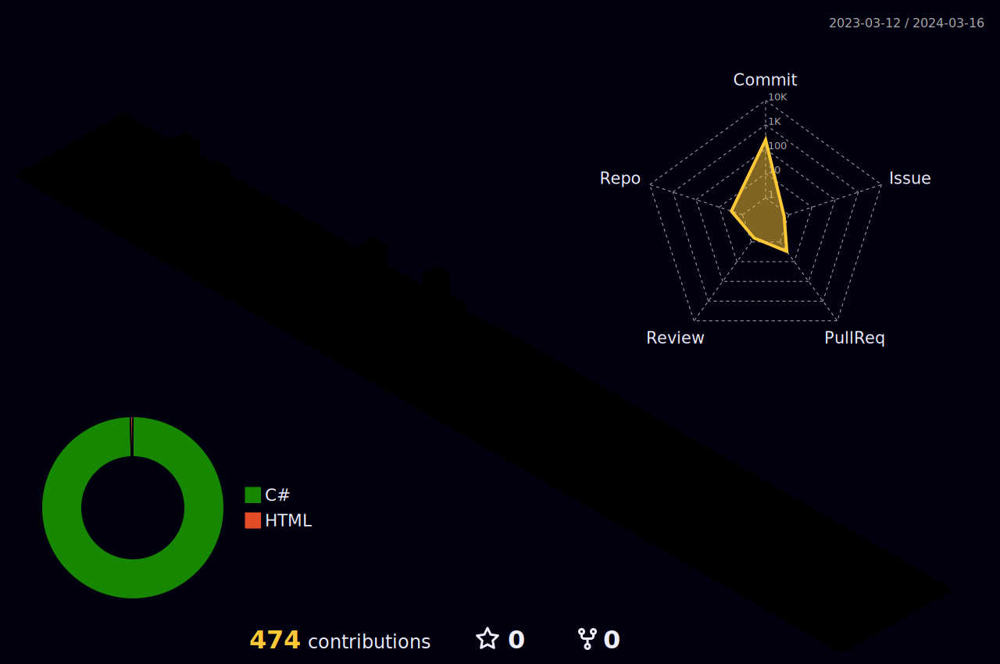

### Hi there 👋

 _______  

<!--
22.08.01    - 펀웨이브 입사
22.12       - E.G 팀의 
23.02       - 한신대학교 졸업
23.02 ~ 07  - 규링소프트 팀의 Withering Fairy 개발 및 GIGDC 참여
23.07.28 ~ 30 - 전북 글로벌 게임잼 참여, Alive 팀에서 fly to school 제작
23.08 ~     - HONMONO 팀에서 무한의 우로보로스 제작중

-->
